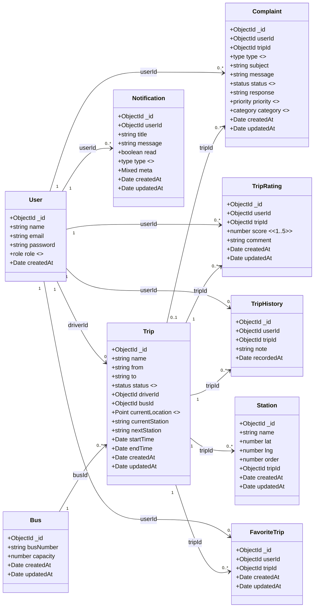

# WinLkar Android App (Java)

A fully functional Android app with two interfaces:

- Driver interface: create route, start trip, and publish real-time bus location.
- Passenger interface: see all active buses and stations in real time.

## Tech stack

- Java (Android)
- Google Maps SDK
- Google Places Autocomplete
- Firebase Realtime Database (no authentication)

## Features

### Driver

- Select start and end points via Places Autocomplete.
- Enter manual bus ID or auto-generate one when starting.
- Start trip and publish live GPS location to Firebase.
- See current bus marker on map.
- End trip and remove bus from active trips list.

### Passenger

- Open map and instantly see active buses.
- See predefined station markers.
- Tap bus marker to view:
  - Bus ID
  - Route description
  - Estimated time to nearest station (simple approximation)
- Bus markers move in real time via Firebase listeners.

## Project structure

- app/src/main/java/com/winlkar/app/MainActivity.java
- app/src/main/java/com/winlkar/app/DriverActivity.java
- app/src/main/java/com/winlkar/app/PassengerActivity.java
- app/src/main/java/com/winlkar/app/model/ActiveTrip.java

## Setup

1. Create a Firebase project.
2. Enable Realtime Database.
3. Download google-services.json and place it at:
   - app/google-services.json
4. In Google Cloud Console, enable:

- Maps SDK for Android
- Places API (New)

1. Ensure billing is enabled on the Google Cloud project.
1. In API key restrictions, allow this key to call:

- Maps SDK for Android
- Places API (New)

1. If you use Android app restrictions for the key, add the app package and SHA-1 that match your debug/release signing.
1. Put your Maps API key in:

- app/src/main/res/values/strings.xml
- Replace `YOUR_GOOGLE_MAPS_API_KEY`.

1. Sync and run in Android Studio.

## Firebase Realtime Database schema

Data is written under:

- activeTrips/{busId}

Each item includes:

- busId
- routeFrom
- routeTo
- routeDescription
- lat
- lng
- lastUpdated
- active

## Firebase rules (no auth)

Use this for development only:

```json
{
  "rules": {
    "activeTrips": {
      ".read": true,
      ".write": true
    }
  }
}
```

## Backend API (Node.js)

This repo also includes a **REST + Socket.IO** backend under **`backend/`** (MongoDB, JWT, roles: passenger / driver / admin). Use it if you migrate off Firebase or need a single API for web and mobile.

- **Quick start:** [backend/README.md](backend/README.md)
- **Docker Compose (detailed):** [backend/docs/DOCKER_COMPOSE.md](backend/docs/DOCKER_COMPOSE.md)
- **Frontend / Android integration:** [backend/docs/FRONTEND_INTEGRATION.md](backend/docs/FRONTEND_INTEGRATION.md)

## Diagrams (UML) — Backend API

### Class diagram



### Use case diagram

```mermaid
flowchart LR
  Passenger[Acteur: Passenger]
  Driver[Acteur: Driver]
  Admin[Acteur: Admin]

  subgraph SYS[Bus Tracking API]
    UC_Register((S'inscrire))
    UC_Login((Se connecter))
    UC_Me((Voir profil me))

    UC_UpdateMe((Modifier mon profil))
    UC_DeleteMe((Supprimer mon compte))

    UC_ListActive((Voir trajets actifs))
    UC_GetTrip((Consulter un trajet))
    UC_Nearest((Trouver bus les plus proches))
    UC_StationEtas((Voir ETA des stations d'un trajet))
    UC_ListStationsByTrip((Lister stations d'un trajet))

    UC_Fav_List((Lister favoris))
    UC_Fav_Add((Ajouter favori))
    UC_Fav_Remove((Retirer favori))

    UC_Hist_List((Lister historique))
    UC_Hist_Add((Ajouter à l'historique))
    UC_Hist_Remove((Supprimer entrée historique))

    UC_Rate((Noter un trajet))
    UC_MyRatings((Voir mes notes))
    UC_TripRatings((Voir notes d'un trajet))

    UC_Complaint_Create((Créer réclamation))
    UC_Complaint_Mine((Voir mes réclamations))

    UC_Notif_List((Lister notifications))
    UC_Notif_ReadOne((Marquer notification lue))
    UC_Notif_ReadAll((Tout marquer lu))

    UC_Trip_Start((Démarrer un trajet))
    UC_Trip_Location((Mettre à jour la position))
    UC_Trip_Status((Mettre à jour le statut))
    UC_Trip_End((Terminer le trajet))

    UC_Admin_Users((Gérer utilisateurs))
    UC_Admin_Buses((Gérer bus))
    UC_Admin_Trips((Gérer trajets))
    UC_Admin_Stations((Gérer stations))
    UC_Admin_Complaints((Gérer réclamations))
  end

  Passenger --> UC_Register
  Driver --> UC_Register
  Admin --> UC_Login
  Passenger --> UC_Login
  Driver --> UC_Login

  Passenger --> UC_Me
  Driver --> UC_Me
  Admin --> UC_Me

  Passenger --> UC_UpdateMe
  Driver --> UC_UpdateMe
  Admin --> UC_UpdateMe

  Passenger --> UC_DeleteMe
  Driver --> UC_DeleteMe
  Admin --> UC_DeleteMe

  Passenger --> UC_ListActive
  Driver --> UC_ListActive
  Admin --> UC_ListActive

  Passenger --> UC_GetTrip
  Driver --> UC_GetTrip
  Admin --> UC_GetTrip

  Passenger --> UC_Nearest
  Driver --> UC_Nearest
  Admin --> UC_Nearest

  Passenger --> UC_StationEtas
  Driver --> UC_StationEtas
  Admin --> UC_StationEtas

  Passenger --> UC_ListStationsByTrip
  Driver --> UC_ListStationsByTrip
  Admin --> UC_ListStationsByTrip

  Passenger --> UC_Fav_List
  Passenger --> UC_Fav_Add
  Passenger --> UC_Fav_Remove

  Passenger --> UC_Hist_List
  Passenger --> UC_Hist_Add
  Passenger --> UC_Hist_Remove

  Passenger --> UC_Rate
  Passenger --> UC_MyRatings
  Passenger --> UC_TripRatings

  Passenger --> UC_Complaint_Create
  Driver --> UC_Complaint_Create
  Passenger --> UC_Complaint_Mine
  Driver --> UC_Complaint_Mine

  Passenger --> UC_Notif_List
  Driver --> UC_Notif_List
  Admin --> UC_Notif_List
  Passenger --> UC_Notif_ReadOne
  Driver --> UC_Notif_ReadOne
  Admin --> UC_Notif_ReadOne
  Passenger --> UC_Notif_ReadAll
  Driver --> UC_Notif_ReadAll
  Admin --> UC_Notif_ReadAll

  Driver --> UC_Trip_Start
  Driver --> UC_Trip_Location
  Driver --> UC_Trip_Status
  Driver --> UC_Trip_End

  Admin --> UC_Admin_Users
  Admin --> UC_Admin_Buses
  Admin --> UC_Admin_Trips
  Admin --> UC_Admin_Stations
  Admin --> UC_Admin_Complaints
```



## Notes

- No authentication is used, as requested.
- Driver location sharing uses high-accuracy fused location updates.
- If google-services.json is missing, app still builds, but Firebase features are disabled.

