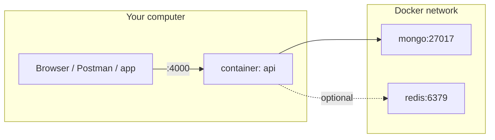

# Docker Compose — full guide (Bus Tracking API)

This guide explains how the backend runs in Docker: services, ports, environment variables, day‑to‑day commands, optional Redis, seeding, and troubleshooting.

**Compose file location:** `backend/docker-compose.yml`  
**Run all commands from the `backend` folder** (same folder as `Dockerfile` and `docker-compose.yml`).

```bash
cd backend
```

---

## What runs in the stack

| Service | Image / build | Role |
|---------|----------------|------|
| **api** | Built from `backend/Dockerfile` (Node 20 Alpine) | Express REST (`/api`), Socket.IO on the same HTTP server |
| **mongo** | `mongo:7` | MongoDB for Mongoose; data persisted in Docker volume `mongo_data` |
| **redis** | `redis:7-alpine` | **Optional** — only started with profile `cache`; caches nearest‑bus query results |

**Default URLs (host machine):**

| Purpose | URL |
|---------|-----|
| API + Socket.IO | `http://localhost:4000` |
| REST prefix | `http://localhost:4000/api` |
| Health | `GET http://localhost:4000/api/health` |
| Swagger UI | `http://localhost:4000/api/docs` |
| MongoDB (from your PC) | `mongodb://localhost:27017` (database name `bus_tracking` inside the stack) |

**Inside Docker network** (only other containers use these hostnames):

- API connects to MongoDB with: `mongodb://mongo:27017/bus_tracking`
- With Redis profile: `redis://redis:6379`



---

## Prerequisites

1. **Docker Engine** and **Docker Compose V2** (`docker compose` subcommand, not only the old `docker-compose` binary).
   - Windows: Docker Desktop.
   - Verify: `docker --version` and `docker compose version`.
2. **Ports free on the host:**
   - `4000` — API (change the left side of `ports` in `docker-compose.yml` if busy).
   - `27017` — MongoDB (optional to expose; see [Production notes](#production-hardening-hints)).
3. **Disk space** for images and the `mongo_data` volume.

---

## First-time run (step by step)

### 1. Go to the backend directory

```bash
cd path/to/winlkarr/backend
```

### 2. Set `JWT_SECRET` for Compose

Compose reads variables from a **`.env` file in the same directory as `docker-compose.yml`** (i.e. `backend/.env`). That file is **not** copied into the image; it is used when you run `docker compose`.

Create or edit **`backend/.env`** and set at least:

```env
JWT_SECRET=your_long_random_secret_at_least_32_chars
```

If `JWT_SECRET` is missing, Compose falls back to the default in `docker-compose.yml` (`change_me_in_production_use_long_random`), which is **not safe** for real deployments.

Optional: override Redis when using the cache profile:

```env
REDIS_URL=redis://redis:6379
```

### 3. Build and start containers

Foreground (logs in terminal):

```bash
docker compose up --build
```

Detached (background):

```bash
docker compose up --build -d
```

The first build downloads base images and runs `npm ci` / `npm install` inside the Dockerfile, then starts **mongo** and **api**. The API waits until MongoDB passes its healthcheck before staying up reliably.

### 4. Check that the API is alive

```bash
curl http://localhost:4000/api/health
```

Expected JSON includes `"ok": true`.

Open **Swagger**: [http://localhost:4000/api/docs](http://localhost:4000/api/docs)

### 5. (Optional) Load sample data

The API container has the app code including `scripts/seed.js`. Run:

```bash
docker compose exec api node scripts/seed.js
```

The script prints seed user emails and passwords (development only). It connects using `MONGODB_URI` already set inside the container (`mongodb://mongo:27017/bus_tracking`).

---

## Environment variables reference

### Injected by `docker-compose.yml` into the `api` service

| Variable | Set in compose | Meaning |
|----------|----------------|---------|
| `NODE_ENV` | `production` | Production mode for Node |
| `PORT` | `4000` | Port the Node process listens on **inside** the container (must match `EXPOSE` / port mapping) |
| `MONGODB_URI` | `mongodb://mongo:27017/bus_tracking` | Mongo host **`mongo`** is the Docker service name |
| `JWT_SECRET` | `${JWT_SECRET:-change_me...}` | From **host** `backend/.env` or shell; strong secret required for production |
| `JWT_EXPIRES_IN` | `7d` | JWT lifetime |
| `CORS_ORIGIN` | `*` | Allowed CORS origins for REST (`*` = any origin) |
| `SOCKET_CORS_ORIGIN` | `*` | Socket.IO CORS |
| `REDIS_URL` | `${REDIS_URL:-}` | Empty by default; set to `redis://redis:6379` when using Redis profile |

Your **local** `npm run dev` `.env` may use `mongodb://localhost:27017/...`; in Compose, **`mongo` is the hostname**, not `localhost`, inside the `api` container.

### Changing the published API port

Edit `docker-compose.yml`:

```yaml
ports:
  - "4001:4000"   # host:container — API on http://localhost:4001
```

If you change the **container** port, you must also change `PORT` in `environment` and the Dockerfile `EXPOSE` / second number in `ports` to match.

---

## Optional Redis (nearest-bus cache)

Without Redis, nearest-bus queries work; caching is skipped.

1. Add to **`backend/.env`** (or export in shell):

   ```env
   REDIS_URL=redis://redis:6379
   ```

2. Start with the **cache** profile so the `redis` service is created:

   ```bash
   docker compose --profile cache up --build
   ```

   Or detached:

   ```bash
   docker compose --profile cache up --build -d
   ```

3. Redis is available inside the network at host **`redis`**, port **6379**. Host machine: `localhost:6379` if you need a desktop Redis client.

---

## Common Docker Compose commands

| Task | Command |
|------|---------|
| Build images | `docker compose build` |
| Start (already built) | `docker compose up` |
| Start detached | `docker compose up -d` |
| Stop containers | `docker compose stop` |
| Stop and remove containers | `docker compose down` |
| Stop and remove containers **and** Mongo volume | `docker compose down -v` |
| View logs (follow) | `docker compose logs -f` |
| Logs for one service | `docker compose logs -f api` |
| Run a one-off command in `api` | `docker compose exec api sh` or `docker compose exec api node scripts/seed.js` |
| Rebuild after code change | `docker compose up --build` |

After `docker compose down -v`, **all MongoDB data in the volume is deleted**.

---

## Dockerfile behavior (short)

- Base: **`node:20-alpine`**
- Installs **production** dependencies only (`npm ci --omit=dev` or `npm install --omit=dev`)
- **`CMD ["node", "server.js"]`** — no watch mode; for local hot reload use `npm run dev` on the host instead of Docker, or mount source with a dev compose override (not included by default)

---

## Networking cheat sheet

| From | To MongoDB | To API |
|------|------------|--------|
| Your browser / phone on same PC | N/A (use API only) | `http://localhost:4000` |
| Another device on LAN | N/A | `http://<PC_LAN_IP>:4000` |
| `api` container | `mongodb://mongo:27017/bus_tracking` | listens on `4000` |

Android emulator: use `http://10.0.2.2:4000` to reach the host’s published port (see [FRONTEND_INTEGRATION.md](./FRONTEND_INTEGRATION.md)).

---

## Troubleshooting

### `port is already allocated` / `EADDRINUSE` on 4000 or 27017

Something else on the host is using that port. Either stop that process or change the **left** side of `ports` in `docker-compose.yml` (for API or Mongo).

### API exits or errors right after start

1. `docker compose logs api` — look for Mongo connection errors.
2. Ensure `mongo` is healthy: `docker compose ps` and `docker compose logs mongo`.
3. Wait a few seconds after first `up`; Mongo healthcheck must pass.

### `Cannot connect` from mobile to `localhost`

`localhost` on the phone is the phone itself. Use your computer’s **LAN IP** and ensure the firewall allows inbound TCP on the published API port.

### Seed script fails

Run `docker compose exec api node scripts/seed.js` only when the `api` container is running. Check `docker compose ps`.

### CORS / Socket.IO blocked in browser

Adjust `CORS_ORIGIN` and `SOCKET_CORS_ORIGIN` in `docker-compose.yml` (or use an override file) to your real web app origin instead of `*` if you use credentials.

---

## Production hardening hints

- Set a strong **`JWT_SECRET`** via secrets or CI, not a default string.
- **Do not publish** MongoDB port `27017` to the internet; remove or restrict the `mongo` `ports:` section and only allow `api` → `mongo` on the internal network.
- Put the API behind **HTTPS** (reverse proxy) and tighten **CORS** to known frontends.
- Use tagged image versions and scan images for vulnerabilities.
- Back up the **`mongo_data`** volume or use a managed MongoDB and set `MONGODB_URI` accordingly (you would change `api` `environment` and possibly remove the `mongo` service).

---

## Related docs

- [Backend README](../README.md) — local Node setup without Docker
- [Frontend integration](./FRONTEND_INTEGRATION.md) — JWT, REST paths, Socket.IO events
